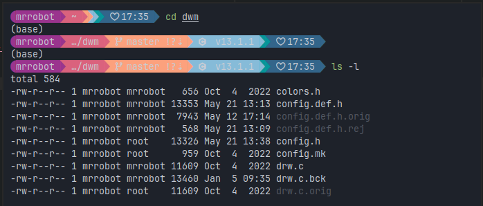
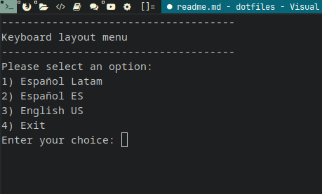

Dotfiles for newdwm installation (based on archcraft-dwm)

# Instrucciones

Descargar el script de [instalación](install_dwm.sh) y ejecutarlo:
   
```bash
curl -sL https://raw.githubusercontent.com/jealcalat/dotfiles/install_dwm.sh | bash
```

# Screenshots

- Statusbar


- Alacritty terminal
)

- Custom scripts
  
